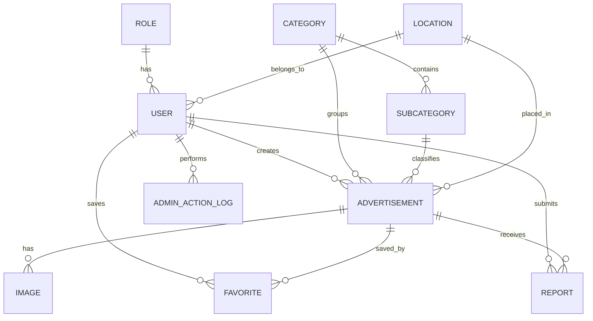

# Corrected System Specification

# Баян-Өлгий Иргэдэд Зориулсан Цогц Зар, Мэдээллийн Платформ

Хувилбар: MVP 1.0  
Огноо: 2026  
Зассан үндсэн шийдвэр: React Native mobile-first, NestJS backend, PostgreSQL database, React Vite admin web panel

---

# 1. Төслийн Танилцуулга

Энэхүү систем нь Баян-Өлгий аймгийн иргэд болон Улаанбаатар хотод сурч, ажиллаж, амьдарч байгаа Баян-Өлгийн иргэдэд зориулсан төвлөрсөн зар, худалдаа, мэдээллийн платформ юм.

Одоогийн байдлаар энэхүү хэрэглэгчдийн дунд зар худалдаа, мэдээлэл солилцох үйл ажиллагаа ихэвчлэн Facebook группүүдээр дамжин явагддаг. Гэвч Facebook группүүд нь зар хайх, ангилах, давхардсан зар ялгах, хэрэгтэй мэдээллээ хурдан олох, spam болон хамааралгүй пост хянах тал дээр хангалтгүй.

Тиймээс хэрэглэгчдийн өдөр тутмын зар, худалдаа, мэдээллийн хэрэгцээнд зориулсан илүү бүтэцтэй, ангилалтай, хайлттай, хэрэглэгч төвтэй mobile-first платформ боловсруулах шаардлагатай.

---

# 2. Системийн Зорилго

Баян-Өлгий аймаг болон Улаанбаатар хот дахь Баян-Өлгийн иргэдийн зар, худалдаа, мэдээллийн хэрэгцээнд зориулсан төвлөрсөн, ангилалтай, хайлттай, хэрэглэгчдэд ойлгомжтой платформ бий болгох.

---

# 3. Зорилтот Хэрэглэгчид

| # | Хэрэглэгчийн бүлэг | Үндсэн хэрэгцээ |
|---|---|---|
| 1 | Баян-Өлгий аймгийн иргэд | Аймаг доторх худалдаа, зар, мэдээлэл солилцох |
| 2 | УБ хотод сурч буй БӨ оюутнууд | Байр хайх, бараа худалдах, roommate олох, дайвар явуулах |
| 3 | УБ-д ажиллаж амьдарч буй БӨ иргэд | Хот дотор болон аймаг хоорондын худалдаа, үйлчилгээ |
| 4 | Зар тавигчид | Бараа, үйлчилгээ, мэдээлэл нийтлэх |
| 5 | Зар хайгчид | Тодорхой хэрэгцээндээ таарсан зар хайх |
| 6 | Admin / Moderator | Зөрчилтэй зар, spam, хэрэглэгч, report хянах |

---

# 4. Зассан Technology Stack

## MVP Stack

- Mobile app: React Native + Expo
- Backend API: NestJS + TypeScript
- Database: PostgreSQL
- Admin web panel: React Vite + TypeScript
- Authentication: JWT
- Deployment: Docker

## Future Stack

- Public web marketplace: React Vite
- Object storage: S3-compatible storage эсвэл cloud storage
- Notification: push notification service
- Search: PostgreSQL full-text search, дараа нь AI search / semantic search

---

# 5. Зассан Development Strategy

## Phase 1 — Mobile-first MVP

- NestJS backend API
- PostgreSQL database
- React Native + Expo mobile app
- Core marketplace workflow

## Phase 2 — Admin Web Panel

- React Vite admin panel
- Report moderation
- User block/suspend
- Ad hide/delete
- Category management
- Dashboard statistics

## Phase 3 — Future Public Web

- Public web marketplace
- SEO-friendly listing/detail pages
- Web-based ad creation

---

# 6. System Architecture

```text
React Native Mobile App
          |
      REST API / JSON
          |
    NestJS Backend API
          |
      PostgreSQL
```

Admin panel:

```text
React Vite Admin Web Panel
            |
        Same REST API
            |
      NestJS Backend API
            |
        PostgreSQL
```

---

# 7. MVP Scope

## MVP-д орох боломжууд

- User register / login / logout
- JWT authentication
- Profile харах, засах
- Category, subcategory харах
- Location сонгох
- Зар оруулах
- Зар засах
- Зар устгах буюу soft delete хийх
- Зарын зураг upload хийх
- Зарын жагсаалт харах
- Зарын дэлгэрэнгүй харах
- Keyword search
- Category, subcategory, location, price filter
- Sort: newest, oldest, most viewed, price ascending, price descending
- Favorite хадгалах, устгах, жагсаалт харах
- Report илгээх
- Admin report review
- Admin ad hide/delete
- Admin user block/suspend
- Admin category management
- Admin dashboard statistics
- Admin action log

## MVP-д орохгүй боломжууд

- Real-time chat
- Push notification
- Payment integration
- Boosted ads
- AI recommendation
- AI search
- Review/rating system
- Verified seller
- Public web marketplace
- Advanced analytics

---

# 8. Roles

| Role | Тайлбар | Үндсэн эрх |
|---|---|---|
| Guest | Нэвтрээгүй хэрэглэгч. Database role биш. | Зар харах, хайлт хийх, category харах |
| USER | Бүртгэлтэй хэрэглэгч | Зар оруулах, засах, устгах, favorite, report |
| ADMIN | Системийн администратор | Бүх эрх, moderation, хэрэглэгч удирдах |
| MODERATOR | Хяналтын хэрэглэгч | Report шалгах, зар hide/delete хийх |

Guest нь database дээр role болж хадгалагдахгүй. Guest бол token-гүй public request-ийн төлөв.

---

# 9. Corrected Status Values

## User Status

- ACTIVE
- SUSPENDED
- BLOCKED

## Advertisement Status

- ACTIVE
- SOLD
- INACTIVE
- EXPIRED
- HIDDEN
- DELETED

## Report Status

- PENDING
- REVIEWED
- RESOLVED
- REJECTED

## Report Reasons

- SPAM
- FAKE
- SCAM
- DUPLICATE
- INAPPROPRIATE
- OTHER

---

# 10. Functional Requirements

## 10.1 Authentication

| ID | Requirement | Priority |
|---|---|---|
| FR-01 | Хэрэглэгч бүртгүүлэх | Must |
| FR-02 | Хэрэглэгч нэвтрэх | Must |
| FR-03 | Хэрэглэгч logout хийх | Must |
| FR-04 | Профайл харах | Must |
| FR-05 | Профайл засах | Should |
| FR-06 | Нууц үг солих | Should |
| FR-07 | Нууц үг сэргээх | Could |

### Acceptance

- Давхардсан утсаар бүртгүүлэх боломжгүй.
- Password hash хэлбэрээр хадгалагдана.
- Login амжилттай бол JWT token үүснэ.
- Logout хийсний дараа protected action хийх боломжгүй.
- Нууц үг хамгийн багадаа 8 тэмдэгттэй байна.

## 10.2 Guest Role

| ID | Requirement | Priority |
|---|---|---|
| FR-08 | Guest хэрэглэгч зар харах | Must |
| FR-09 | Guest хэрэглэгч хайлт хийх | Must |
| FR-10 | Guest хэрэглэгч зар оруулах боломжгүй байх | Must |

### Acceptance

- Guest нь public active заруудыг харна.
- Guest нь keyword, category, location, price filter ашиглаж болно.
- Зар оруулах, favorite хадгалах, report хийх үед login шаардана.

## 10.3 Registered User

| ID | Requirement | Priority |
|---|---|---|
| FR-11 | Registered user зар оруулах | Must |
| FR-12 | Өөрийн зараа засах | Must |
| FR-13 | Өөрийн зараа устгах | Must |
| FR-14 | Favorite ашиглах | Should |
| FR-15 | Зар report хийх | Should |
| FR-16 | Зар тавигчтай холбогдох | Must |

### Acceptance

- Зөвхөн login хийсэн хэрэглэгч зар publish хийнэ.
- Хэрэглэгч зөвхөн өөрийн зараа засаж, устгана.
- Favorite нь нэг хэрэглэгч, нэг зар дээр давхардахгүй.
- Report нь нэг хэрэглэгч, нэг зар дээр давхар spam болохгүй.

## 10.4 Admin / Moderator

| ID | Requirement | Priority |
|---|---|---|
| FR-17 | Admin зар удирдах | Must |
| FR-18 | Admin хэрэглэгч удирдах | Must |
| FR-19 | Admin category удирдах | Should |
| FR-20 | Admin report review хийх | Must |

### Acceptance

- Admin зарыг hide/delete хийж чадна.
- Admin хэрэглэгчийг block/suspend хийж чадна.
- Admin report бүр дээр шийдвэр гаргана.
- Admin үйлдэл бүр `admin_action_logs` table-д бүртгэгдэнэ.

## 10.5 Advertisement

| ID | Requirement | Priority |
|---|---|---|
| FR-21 | Шинэ зар үүсгэх | Must |
| FR-22 | Зураг upload хийх | Must |
| FR-23 | Зар update хийх | Must |
| FR-24 | Зар устгах | Must |
| FR-25 | Зар status update хийх | Must |
| FR-26 | Зар expire хийх | Must |
| FR-27 | Зарын owner шалгах | Must |
| FR-28 | Зарын validation хийх | Must |
| FR-29 | Зарын created/updated date хадгалах | Must |
| FR-30 | Soft delete ашиглах | Should |

### Required Fields

- title
- description
- categoryId
- locationId
- at least 1 image
- contactPhone

### Optional Fields

- price
- subcategoryId
- expiredAt

## 10.6 Category

| ID | Requirement | Priority |
|---|---|---|
| FR-31 | Category list харах | Must |
| FR-32 | Subcategory list харах | Must |
| FR-33 | Category detail харах | Should |
| FR-34 | Category icon харуулах | Should |
| FR-35 | Category filter ашиглах | Must |
| FR-36 | Admin category нэмэх | Should |
| FR-37 | Admin category засах | Should |
| FR-38 | Admin category disable хийх | Should |
| FR-39 | Subcategory удирдах | Should |
| FR-40 | Inactive category public дээр нуух | Must |

## 10.7 Search / Filter

| ID | Requirement | Priority |
|---|---|---|
| FR-41 | Keyword search | Must |
| FR-42 | Category filter | Must |
| FR-43 | Price filter | Must |
| FR-44 | Sort хийх | Must |
| FR-45 | Default search active зар л харуулах | Must |
| FR-46 | Advanced filter | Should |
| FR-47 | Search history | Could |
| FR-48 | Trending search | Could |

### Search Query Parameters

- page
- size
- keyword
- categoryId
- subcategoryId
- locationId
- minPrice
- maxPrice
- sort
- status

### Sort Values

- newest
- oldest
- mostViewed
- priceAsc
- priceDesc

## 10.8 Ad Detail

| ID | Requirement | Priority |
|---|---|---|
| FR-49 | Зарын дэлгэрэнгүй харах | Must |
| FR-50 | Зарын image gallery | Must |
| FR-51 | Seller basic info харах | Must |
| FR-52 | Contact info харах | Must |
| FR-53 | Similar ads харуулах | Should |
| FR-54 | View count нэмэх | Should |

## 10.9 Favorite

| ID | Requirement | Priority |
|---|---|---|
| FR-55 | Зар favorite хадгалах | Should |
| FR-56 | Favorite list харах | Should |
| FR-57 | Favorite remove хийх | Should |

## 10.10 Chat / Contact

| ID | Requirement | Priority |
|---|---|---|
| FR-58 | Chat эхлүүлэх | Could |
| FR-59 | Message илгээх | Could |
| FR-60 | Message history хадгалах | Could |
| FR-61 | Unread message indicator | Could |

MVP дээр chat орохгүй. MVP дээр contact phone харах workflow ашиглана.

## 10.11 Report

| ID | Requirement | Priority |
|---|---|---|
| FR-62 | Зар report хийх | Must |
| FR-63 | Report comment бичих | Should |
| FR-64 | Report submit хийх | Must |
| FR-65 | Давтан spam report-оос хамгаалах | Should |

## 10.12 Admin / Moderation

| ID | Requirement | Priority |
|---|---|---|
| FR-66 | Admin reported ads харах | Must |
| FR-67 | Admin зар устгах | Must |
| FR-68 | Admin зар hide хийх | Must |
| FR-69 | Admin хэрэглэгч suspend хийх | Must |
| FR-70 | Admin user block хийх | Must |
| FR-71 | Admin spam detection review | Should |
| FR-72 | Admin dashboard харах | Should |

## 10.13 Notification

| ID | Requirement | Priority |
|---|---|---|
| FR-73 | Шинэ message notification | Could |
| FR-74 | Зарын хугацаа дуусах notification | Could |
| FR-75 | Favorite зар update notification | Could |

Notification нь MVP-д орохгүй.

## 10.14 Content Quality

| ID | Requirement | Priority |
|---|---|---|
| FR-76 | Spam content detection | Should |
| FR-77 | Duplicate ad detection | Should |
| FR-78 | Expired ads hide хийх | Must |
| FR-79 | Inappropriate word filter | Could |

## 10.15 Functional бус шаардлагатай холбоотой FR

| ID | Requirement | Priority |
|---|---|---|
| FR-80 | Responsive admin web UI | Must |
| FR-81 | Fast loading | Must |
| FR-82 | Secure authentication | Must |
| FR-83 | Scalable architecture | Should |
| FR-84 | Image optimization | Should |
| FR-85 | Availability | Should |

---

# 11. Non-Functional Requirements

## 11.1 Performance

| ID | Requirement |
|---|---|
| NFR-01 | Mobile home болон admin dashboard 3 секундээс бага хугацаанд ачаална |
| NFR-02 | Search response 1-2 секундийн дотор ирнэ |
| NFR-03 | Эхний хувилбарт 500-1000 concurrent user дэмжихээр төлөвлөнө |

## 11.2 Security

| ID | Requirement |
|---|---|
| NFR-04 | Password hash, JWT, login attempt protection ашиглана |
| NFR-05 | Role-based access control хэрэгжинэ |
| NFR-06 | API validation, SQL injection, XSS, CSRF хамгаалалт хийнэ |
| NFR-07 | Хувийн мэдээллийг зөвшөөрөлгүй харуулахгүй |

## 11.3 Usability

| ID | Requirement |
|---|---|
| NFR-08 | Зар оруулах нь Facebook post бичихтэй адил энгийн байна |
| NFR-09 | Mobile-first UX ашиглана |
| NFR-10 | Admin web responsive байна |

## 11.4 Cross-platform

| ID | Requirement |
|---|---|
| NFR-11 | Mobile app болон admin web нэг backend API ашиглана |
| NFR-12 | Category, status, error message хоёр platform дээр ижил байна |

## 11.5 Reliability / Availability

| ID | Requirement |
|---|---|
| NFR-13 | Database transaction ашиглана |
| NFR-14 | Daily database backup хийх боломжтой байна |
| NFR-15 | System uptime өндөр байна |

## 11.6 Scalability / Maintainability

| ID | Requirement |
|---|---|
| NFR-16 | Modular monolith NestJS architecture ашиглана |
| NFR-17 | Image storage өргөтгөх боломжтой байна |
| NFR-18 | Backend module-based, mobile component-based бүтэцтэй байна |
| NFR-19 | Requirement, ERD, API, setup, deployment docs байна |

## 11.7 Compatibility

| ID | Requirement |
|---|---|
| NFR-20 | Admin web Chrome, Edge, Safari, Firefox дээр ажиллана |
| NFR-21 | Mobile app Android priority, iOS future support байна |

## 11.8 Data / Network

| ID | Requirement |
|---|---|
| NFR-22 | Зар, хэрэглэгч, category, report өгөгдөл зөрчилгүй байна |
| NFR-23 | Frontend болон backend validation хийнэ |
| NFR-24 | Сүлжээ муу үед loading, retry, error state харуулна |

## 11.9 Moderation / Localization / Monitoring

| ID | Requirement |
|---|---|
| NFR-25 | Report болон admin moderation байна |
| NFR-26 | Зар бүр ойлгомжтой, хэрэгтэй мэдээлэлтэй байна |
| NFR-27 | UI text Монгол хэл дээр байна |
| NFR-28 | Баян-Өлгийн хэрэглэгчдэд тохирсон нэршил ашиглана |
| NFR-29 | Backend error, API request, login, ad creation log хадгална |
| NFR-30 | Admin action бүр бүртгэгдэнэ |

## 11.10 Deployment / Testing / Accessibility

| ID | Requirement |
|---|---|
| NFR-31 | Docker ашиглан backend, admin web, database deploy хийх боломжтой байна |
| NFR-32 | Development, testing, production env config тусдаа байна |
| NFR-33 | Backend API tests байна |
| NFR-34 | Mobile болон admin web гол screen workflow test-тэй байна |
| NFR-35 | Font, button, contrast, error message ойлгомжтой байна |

---

# 12. Use Cases

## Guest Use Cases

| ID | Use Case | Actor |
|---|---|---|
| UC-01 | Зар харах | Guest |
| UC-02 | Зар хайх | Guest |
| UC-03 | Category харах | Guest |
| UC-04 | Зарын дэлгэрэнгүй харах | Guest |
| UC-05 | Бүртгүүлэх | Guest |
| UC-06 | Нэвтрэх | Guest |

## Registered User Use Cases

| ID | Use Case | Actor |
|---|---|---|
| UC-07 | Зар оруулах | USER |
| UC-08 | Өөрийн зараа засах | USER |
| UC-09 | Өөрийн зараа устгах | USER |
| UC-10 | Зар favorite хадгалах | USER |
| UC-11 | Favorite list харах | USER |
| UC-12 | Зар report хийх | USER |
| UC-13 | Профайл удирдах | USER |
| UC-14 | Зар тавигчтай холбогдох | USER |
| UC-15 | Зураг upload хийх | USER |

## Admin / Moderator Use Cases

| ID | Use Case | Actor |
|---|---|---|
| UC-16 | Report шалгах | ADMIN / MODERATOR |
| UC-17 | Зар hide хийх | ADMIN / MODERATOR |
| UC-18 | Зар устгах | ADMIN / MODERATOR |
| UC-19 | Хэрэглэгч block хийх | ADMIN |
| UC-20 | Category удирдах | ADMIN |
| UC-21 | Admin dashboard харах | ADMIN / MODERATOR |

---

# 13. Entity List

## MVP Entities

| # | Entity | Тайлбар |
|---|---|---|
| 1 | User | Систем ашиглагч хэрэглэгч |
| 2 | Role | USER, ADMIN, MODERATOR эрх |
| 3 | Advertisement | Хэрэглэгчийн оруулсан зар |
| 4 | Category | Зарын үндсэн ангилал |
| 5 | SubCategory | Category доторх нарийвчилсан ангилал |
| 6 | Image | Зарын зураг |
| 7 | Location | Байршлын мэдээлэл |
| 8 | Favorite | Хадгалсан зар |
| 9 | Report | Зөрчилтэй зарын гомдол |
| 10 | AdminActionLog | Админы үйлдлийн бүртгэл |

## Future Entities

| # | Entity | Тайлбар |
|---|---|---|
| 11 | ChatRoom | Чатын өрөө |
| 12 | Message | Чатын мессеж |
| 13 | Notification | Мэдэгдэл |
| 14 | Review / Rating | Хэрэглэгчийн үнэлгээ |

---

# 14. Corrected Database Schema

## roles

```sql
CREATE TABLE roles (
    role_id BIGSERIAL PRIMARY KEY,
    role_name VARCHAR(50) NOT NULL UNIQUE
);
```

Role values:

- USER
- ADMIN
- MODERATOR

## locations

```sql
CREATE TABLE locations (
    location_id BIGSERIAL PRIMARY KEY,
    name VARCHAR(100) NOT NULL,
    parent_location_id BIGINT,
    type VARCHAR(50)
);
```

## users

```sql
CREATE TABLE users (
    user_id BIGSERIAL PRIMARY KEY,
    full_name VARCHAR(150) NOT NULL,
    phone VARCHAR(20) NOT NULL UNIQUE,
    email VARCHAR(150) UNIQUE,
    password_hash VARCHAR(255) NOT NULL,
    profile_image VARCHAR(500),
    role_id BIGINT NOT NULL,
    location_id BIGINT,
    status VARCHAR(30) DEFAULT 'ACTIVE',
    created_at TIMESTAMP DEFAULT CURRENT_TIMESTAMP,
    updated_at TIMESTAMP DEFAULT CURRENT_TIMESTAMP
);
```

## categories

```sql
CREATE TABLE categories (
    category_id BIGSERIAL PRIMARY KEY,
    name VARCHAR(100) NOT NULL UNIQUE,
    icon VARCHAR(255),
    description TEXT,
    is_active BOOLEAN DEFAULT TRUE,
    created_at TIMESTAMP DEFAULT CURRENT_TIMESTAMP
);
```

## subcategories

```sql
CREATE TABLE subcategories (
    subcategory_id BIGSERIAL PRIMARY KEY,
    category_id BIGINT NOT NULL,
    name VARCHAR(100) NOT NULL,
    description TEXT,
    is_active BOOLEAN DEFAULT TRUE
);
```

## advertisements

```sql
CREATE TABLE advertisements (
    ad_id BIGSERIAL PRIMARY KEY,
    user_id BIGINT NOT NULL,
    category_id BIGINT NOT NULL,
    subcategory_id BIGINT,
    location_id BIGINT,
    title VARCHAR(200) NOT NULL,
    description TEXT NOT NULL,
    price NUMERIC(12,2),
    status VARCHAR(30) DEFAULT 'ACTIVE',
    view_count INT DEFAULT 0,
    contact_phone VARCHAR(20),
    created_at TIMESTAMP DEFAULT CURRENT_TIMESTAMP,
    updated_at TIMESTAMP DEFAULT CURRENT_TIMESTAMP,
    expired_at TIMESTAMP
);
```

## images

```sql
CREATE TABLE images (
    image_id BIGSERIAL PRIMARY KEY,
    ad_id BIGINT NOT NULL,
    image_url VARCHAR(500) NOT NULL,
    thumbnail_url VARCHAR(500),
    is_main BOOLEAN DEFAULT FALSE,
    uploaded_at TIMESTAMP DEFAULT CURRENT_TIMESTAMP
);
```

## favorites

```sql
CREATE TABLE favorites (
    favorite_id BIGSERIAL PRIMARY KEY,
    user_id BIGINT NOT NULL,
    ad_id BIGINT NOT NULL,
    created_at TIMESTAMP DEFAULT CURRENT_TIMESTAMP,
    CONSTRAINT uq_favorites_user_ad UNIQUE (user_id, ad_id)
);
```

## reports

```sql
CREATE TABLE reports (
    report_id BIGSERIAL PRIMARY KEY,
    reporter_user_id BIGINT NOT NULL,
    ad_id BIGINT NOT NULL,
    reason VARCHAR(50) NOT NULL,
    comment TEXT,
    status VARCHAR(30) DEFAULT 'PENDING',
    created_at TIMESTAMP DEFAULT CURRENT_TIMESTAMP,
    reviewed_at TIMESTAMP,
    reviewed_by BIGINT,
    CONSTRAINT uq_reports_user_ad UNIQUE (reporter_user_id, ad_id)
);
```

## admin_action_logs

```sql
CREATE TABLE admin_action_logs (
    log_id BIGSERIAL PRIMARY KEY,
    admin_user_id BIGINT NOT NULL,
    action_type VARCHAR(50) NOT NULL,
    target_type VARCHAR(50) NOT NULL,
    target_id BIGINT NOT NULL,
    description TEXT,
    created_at TIMESTAMP DEFAULT CURRENT_TIMESTAMP
);
```

## Indexes

```sql
CREATE INDEX idx_ads_category ON advertisements(category_id);
CREATE INDEX idx_ads_subcategory ON advertisements(subcategory_id);
CREATE INDEX idx_ads_location ON advertisements(location_id);
CREATE INDEX idx_ads_status ON advertisements(status);
CREATE INDEX idx_ads_created_at ON advertisements(created_at);
CREATE INDEX idx_ads_price ON advertisements(price);
CREATE INDEX idx_reports_status ON reports(status);
CREATE INDEX idx_admin_logs_admin ON admin_action_logs(admin_user_id);
```

---

# 15. Relationships

| Entity A | Cardinality | Entity B | FK |
|---|---|---|---|
| Role | 1:N | User | role_id |
| User | 1:N | Advertisement | user_id |
| Category | 1:N | SubCategory | category_id |
| Category | 1:N | Advertisement | category_id |
| SubCategory | 1:N | Advertisement | subcategory_id |
| Location | 1:N | User | location_id |
| Location | 1:N | Advertisement | location_id |
| Advertisement | 1:N | Image | ad_id |
| User | 1:N | Favorite | user_id |
| Advertisement | 1:N | Favorite | ad_id |
| User | 1:N | Report | reporter_user_id |
| Advertisement | 1:N | Report | ad_id |
| User(Admin) | 1:N | AdminActionLog | admin_user_id |

## Mermaid ERD



---

# 16. API Contract

Base URL:

```text
/api/v1
```

## Auth APIs

```http
POST /api/v1/auth/register
POST /api/v1/auth/login
POST /api/v1/auth/logout
PATCH /api/v1/auth/change-password
POST /api/v1/auth/password-reset/request
POST /api/v1/auth/password-reset/confirm
```

## User APIs

```http
GET /api/v1/users/me
PUT /api/v1/users/me
GET /api/v1/users/me/ads
```

## Advertisement APIs

```http
GET /api/v1/ads
GET /api/v1/ads/{adId}
POST /api/v1/ads
PUT /api/v1/ads/{adId}
DELETE /api/v1/ads/{adId}
PATCH /api/v1/ads/{adId}/status
```

Query example:

```text
?page=1
&size=20
&categoryId=1
&subcategoryId=2
&locationId=2
&minPrice=100000
&maxPrice=900000
&keyword=байр
&sort=newest
&status=ACTIVE
```

## Image APIs

```http
POST /api/v1/ads/{adId}/images
DELETE /api/v1/images/{imageId}
```

Upload:

```text
Content-Type: multipart/form-data
files: image files
allowed: jpg, jpeg, png, webp
max size: 5MB per image
```

## Category APIs

```http
GET /api/v1/categories
GET /api/v1/categories/{categoryId}/subcategories
```

## Location APIs

```http
GET /api/v1/locations
GET /api/v1/locations/{locationId}/children
```

## Favorite APIs

```http
POST /api/v1/favorites/{adId}
GET /api/v1/favorites
DELETE /api/v1/favorites/{adId}
```

## Report APIs

```http
POST /api/v1/reports
```

Request body:

```json
{
  "adId": 1,
  "reason": "SPAM",
  "comment": "Давхардсан зар байна"
}
```

## Admin APIs

```http
GET /api/v1/admin/reports
PATCH /api/v1/admin/ads/{adId}/hide
DELETE /api/v1/admin/ads/{adId}
PATCH /api/v1/admin/users/{userId}/block
PATCH /api/v1/admin/users/{userId}/suspend
GET /api/v1/admin/dashboard/stats
PATCH /api/v1/admin/reports/{reportId}/resolve
POST /api/v1/admin/categories
PUT /api/v1/admin/categories/{categoryId}
DELETE /api/v1/admin/categories/{categoryId}
POST /api/v1/admin/categories/{categoryId}/subcategories
PUT /api/v1/admin/subcategories/{subcategoryId}
DELETE /api/v1/admin/subcategories/{subcategoryId}
```

---

# 17. Folder Structure

```text
bo-zar-platform
├── backend
├── mobile-app
├── admin-web
├── docs
├── nginx
├── docker-compose.yml
├── README.md
└── .gitignore
```

## Backend

```text
backend
├── src
│   ├── main.ts
│   ├── app.module.ts
│   ├── auth
│   ├── users
│   ├── ads
│   ├── categories
│   ├── locations
│   ├── favorites
│   ├── reports
│   ├── admin
│   ├── images
│   ├── common
│   ├── config
│   └── database
├── test
├── package.json
├── tsconfig.json
├── nest-cli.json
├── Dockerfile
└── README.md
```

## Mobile App

```text
mobile-app
├── src
│   ├── api
│   ├── assets
│   ├── components
│   ├── screens
│   ├── navigation
│   ├── store
│   ├── types
│   ├── utils
│   └── App.tsx
├── app.json
├── package.json
└── README.md
```

## Admin Web

```text
admin-web
├── public
├── src
│   ├── api
│   ├── components
│   ├── features
│   ├── layouts
│   ├── pages
│   ├── routes
│   ├── store
│   ├── types
│   ├── utils
│   ├── App.tsx
│   └── main.tsx
├── package.json
├── vite.config.ts
├── tailwind.config.js
├── Dockerfile
└── README.md
```

---

# 18. Sprint Plan

## Sprint 1 — Project Setup

- NestJS project setup
- PostgreSQL setup
- Docker setup
- JWT configuration
- React Native + Expo setup
- API client setup

Deliverable:

- Backend server ажиллана
- Expo mobile app ажиллана
- Database холбогдсон байна

## Sprint 2 — Authentication

- User entity
- Role entity
- Register API
- Login API
- JWT authentication
- Login/Register screens
- Protected navigation

Deliverable:

- Register/login/logout ажиллана

## Sprint 3 — Category + Advertisement

- Category APIs
- Location APIs
- Advertisement entity
- Create/update/delete ad API
- Home screen
- Category section
- Create ad screen
- Ad detail screen

Deliverable:

- Зар үүсэж, mobile дээр харагдана

## Sprint 4 — Image Upload + Search

- Image upload API
- Local file storage
- Thumbnail generation
- Search/filter API
- Search screen
- Filter UI

Deliverable:

- Зурагтай зар publish болно
- Search/filter ажиллана

## Sprint 5 — Favorite + Report

- Favorite API
- Report API
- Duplicate favorite/report protection
- Favorite screen
- Report modal

Deliverable:

- Favorite болон report workflow ажиллана

## Sprint 6 — Admin API + Admin Web

- Admin APIs
- Admin action log
- User block/suspend
- Ad hide/delete
- Dashboard statistics
- React Vite admin setup
- Report management page
- User management page

Deliverable:

- Admin moderation ажиллана

## Sprint 7 — Testing + Deployment

- API tests
- Mobile workflow tests
- Admin workflow tests
- Bug fixing
- Docker deployment
- Production config

Deliverable:

- Deployable MVP system

---

# 19. UI Planning

## Mobile MVP Screens

- Home Screen
- Search Screen
- Ad Detail Screen
- Create Ad Screen
- Edit Ad Screen
- Favorite Screen
- Profile Screen
- Login Screen
- Register Screen

## Admin Web Screens

- Admin Dashboard
- Report Management
- User Management
- Ad Moderation
- Category Management

## Future Public Web Screens

- Landing / Home Page
- Advertisement List Page
- Advertisement Detail Page
- Create Advertisement Page
- Edit Advertisement Page
- User Profile Page
- Favorite Page

---

# 20. Final Correction Summary

PDF болон өмнөх Markdown баримтуудаас дараах зөрүүг зассан:

- Spring Boot-г NestJS болгосон.
- Web-first strategy-г mobile-first strategy болгосон.
- React Web public app-ийг MVP-ээс гаргаж future scope болгосон.
- React Vite-г admin web panel-д ашиглахаар тодорхойлсон.
- Guest role-г database role биш болгосон.
- Advertisement, User, Report status утгуудыг нэг мөр болгосон.
- `AdminActionLog` entity/table нэмсэн.
- Favorite болон Report дээр duplicate хамгаалалт нэмсэн.
- Location API нэмсэн.
- Admin dashboard, category CRUD, report resolve API нэмсэн.
- Image upload multipart spec нэмсэн.
- UI planning-ийг mobile MVP, admin web, future public web гэж салгасан.
