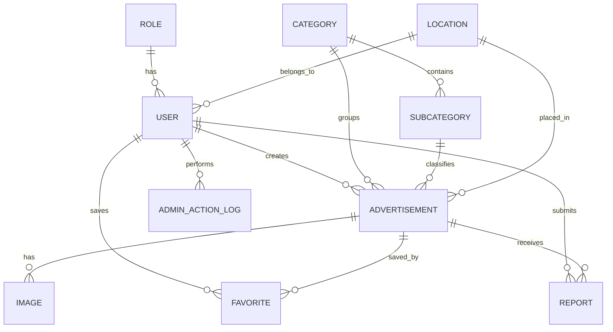

# Corrected Entity Relationship Diagram

# Баян-Өлгий Иргэдэд Зориулсан Цогц Зар, Мэдээллийн Платформ

Хувилбар: MVP 1.0  
Огноо: 2026

---

# ERD Summary

MVP entities:

- Role
- User
- Location
- Category
- SubCategory
- Advertisement
- Image
- Favorite
- Report
- AdminActionLog

---

# Corrected Mermaid ERD



---

# Table Definitions

## ROLE

| Column | Type | Key |
|---|---|---|
| role_id | bigint | PK |
| role_name | varchar | UNIQUE |

Values:

- USER
- ADMIN
- MODERATOR

Guest is not a database role.

## USER

| Column | Type | Key |
|---|---|---|
| user_id | bigint | PK |
| full_name | varchar | |
| phone | varchar | UNIQUE |
| email | varchar | UNIQUE |
| password_hash | varchar | |
| profile_image | varchar | |
| role_id | bigint | FK |
| location_id | bigint | FK |
| status | varchar | |
| created_at | timestamp | |
| updated_at | timestamp | |

Status:

- ACTIVE
- SUSPENDED
- BLOCKED

## LOCATION

| Column | Type | Key |
|---|---|---|
| location_id | bigint | PK |
| name | varchar | |
| parent_location_id | bigint | FK |
| type | varchar | |

## CATEGORY

| Column | Type | Key |
|---|---|---|
| category_id | bigint | PK |
| name | varchar | UNIQUE |
| icon | varchar | |
| description | text | |
| is_active | boolean | |
| created_at | timestamp | |

## SUBCATEGORY

| Column | Type | Key |
|---|---|---|
| subcategory_id | bigint | PK |
| category_id | bigint | FK |
| name | varchar | |
| description | text | |
| is_active | boolean | |

## ADVERTISEMENT

| Column | Type | Key |
|---|---|---|
| ad_id | bigint | PK |
| user_id | bigint | FK |
| category_id | bigint | FK |
| subcategory_id | bigint | FK |
| location_id | bigint | FK |
| title | varchar | |
| description | text | |
| price | decimal | |
| status | varchar | |
| view_count | int | |
| contact_phone | varchar | |
| created_at | timestamp | |
| updated_at | timestamp | |
| expired_at | timestamp | |

Status:

- ACTIVE
- SOLD
- INACTIVE
- EXPIRED
- HIDDEN
- DELETED

## IMAGE

| Column | Type | Key |
|---|---|---|
| image_id | bigint | PK |
| ad_id | bigint | FK |
| image_url | varchar | |
| thumbnail_url | varchar | |
| is_main | boolean | |
| uploaded_at | timestamp | |

## FAVORITE

| Column | Type | Key |
|---|---|---|
| favorite_id | bigint | PK |
| user_id | bigint | FK |
| ad_id | bigint | FK |
| created_at | timestamp | |

Constraint:

- UNIQUE(user_id, ad_id)

## REPORT

| Column | Type | Key |
|---|---|---|
| report_id | bigint | PK |
| reporter_user_id | bigint | FK |
| ad_id | bigint | FK |
| reason | varchar | |
| comment | text | |
| status | varchar | |
| created_at | timestamp | |
| reviewed_at | timestamp | |
| reviewed_by | bigint | FK |

Status:

- PENDING
- REVIEWED
- RESOLVED
- REJECTED

Constraint:

- UNIQUE(reporter_user_id, ad_id)

## ADMIN_ACTION_LOG

| Column | Type | Key |
|---|---|---|
| log_id | bigint | PK |
| admin_user_id | bigint | FK |
| action_type | varchar | |
| target_type | varchar | |
| target_id | bigint | |
| description | text | |
| created_at | timestamp | |

---

# Corrected SQL Schema

```sql
CREATE TABLE roles (
    role_id BIGSERIAL PRIMARY KEY,
    role_name VARCHAR(50) NOT NULL UNIQUE
);

CREATE TABLE locations (
    location_id BIGSERIAL PRIMARY KEY,
    name VARCHAR(100) NOT NULL,
    parent_location_id BIGINT,
    type VARCHAR(50)
);

CREATE TABLE users (
    user_id BIGSERIAL PRIMARY KEY,
    full_name VARCHAR(150) NOT NULL,
    phone VARCHAR(20) NOT NULL UNIQUE,
    email VARCHAR(150) UNIQUE,
    password_hash VARCHAR(255) NOT NULL,
    profile_image VARCHAR(500),
    role_id BIGINT NOT NULL,
    location_id BIGINT,
    status VARCHAR(30) DEFAULT 'ACTIVE',
    created_at TIMESTAMP DEFAULT CURRENT_TIMESTAMP,
    updated_at TIMESTAMP DEFAULT CURRENT_TIMESTAMP
);

CREATE TABLE categories (
    category_id BIGSERIAL PRIMARY KEY,
    name VARCHAR(100) NOT NULL UNIQUE,
    icon VARCHAR(255),
    description TEXT,
    is_active BOOLEAN DEFAULT TRUE,
    created_at TIMESTAMP DEFAULT CURRENT_TIMESTAMP
);

CREATE TABLE subcategories (
    subcategory_id BIGSERIAL PRIMARY KEY,
    category_id BIGINT NOT NULL,
    name VARCHAR(100) NOT NULL,
    description TEXT,
    is_active BOOLEAN DEFAULT TRUE
);

CREATE TABLE advertisements (
    ad_id BIGSERIAL PRIMARY KEY,
    user_id BIGINT NOT NULL,
    category_id BIGINT NOT NULL,
    subcategory_id BIGINT,
    location_id BIGINT,
    title VARCHAR(200) NOT NULL,
    description TEXT NOT NULL,
    price NUMERIC(12,2),
    status VARCHAR(30) DEFAULT 'ACTIVE',
    view_count INT DEFAULT 0,
    contact_phone VARCHAR(20),
    created_at TIMESTAMP DEFAULT CURRENT_TIMESTAMP,
    updated_at TIMESTAMP DEFAULT CURRENT_TIMESTAMP,
    expired_at TIMESTAMP
);

CREATE TABLE images (
    image_id BIGSERIAL PRIMARY KEY,
    ad_id BIGINT NOT NULL,
    image_url VARCHAR(500) NOT NULL,
    thumbnail_url VARCHAR(500),
    is_main BOOLEAN DEFAULT FALSE,
    uploaded_at TIMESTAMP DEFAULT CURRENT_TIMESTAMP
);

CREATE TABLE favorites (
    favorite_id BIGSERIAL PRIMARY KEY,
    user_id BIGINT NOT NULL,
    ad_id BIGINT NOT NULL,
    created_at TIMESTAMP DEFAULT CURRENT_TIMESTAMP,
    CONSTRAINT uq_favorites_user_ad UNIQUE (user_id, ad_id)
);

CREATE TABLE reports (
    report_id BIGSERIAL PRIMARY KEY,
    reporter_user_id BIGINT NOT NULL,
    ad_id BIGINT NOT NULL,
    reason VARCHAR(50) NOT NULL,
    comment TEXT,
    status VARCHAR(30) DEFAULT 'PENDING',
    created_at TIMESTAMP DEFAULT CURRENT_TIMESTAMP,
    reviewed_at TIMESTAMP,
    reviewed_by BIGINT,
    CONSTRAINT uq_reports_user_ad UNIQUE (reporter_user_id, ad_id)
);

CREATE TABLE admin_action_logs (
    log_id BIGSERIAL PRIMARY KEY,
    admin_user_id BIGINT NOT NULL,
    action_type VARCHAR(50) NOT NULL,
    target_type VARCHAR(50) NOT NULL,
    target_id BIGINT NOT NULL,
    description TEXT,
    created_at TIMESTAMP DEFAULT CURRENT_TIMESTAMP
);
```
